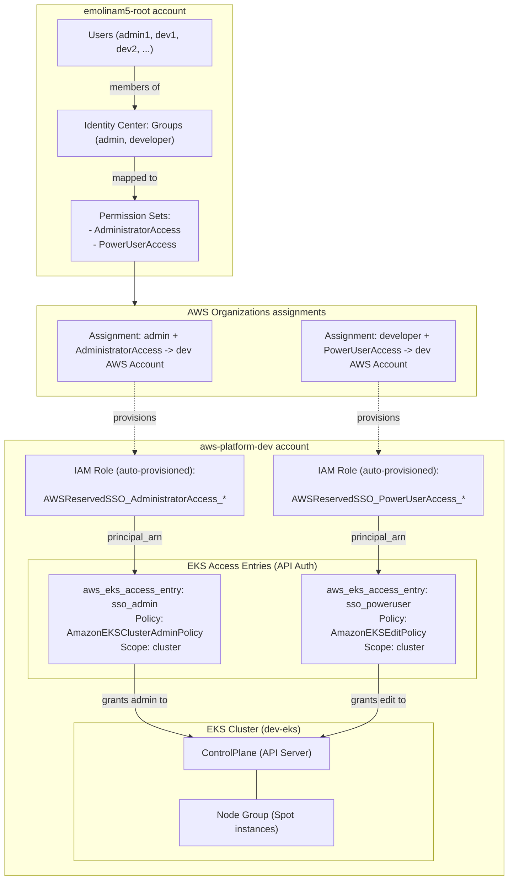
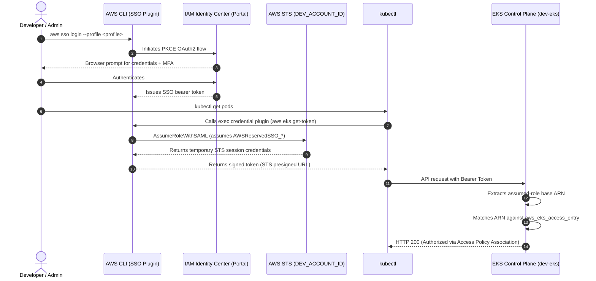
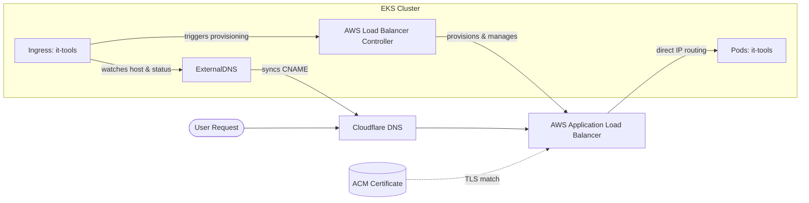

The purpose of this document is to describe how my personal AWS Organization and accounts are configured to allow different users and profiles to use IAM Identity Center to natively access and interact with an EKS cluster.

## Architecture

The following diagram shows the overall flow of how identity and access to the EKS cluster are managed.





1. **Users & Groups**:
   - Users (`admin1`, `dev1`, `dev2`) are defined centrally through Identity Center.
   - Users are grouped into functional teams (e.g., `admin`, `developer`).

2. **Permission Sets**:
   - `AdministratorAccess`: Full administrative privileges across AWS services.
   - `PowerUserAccess`: Full AWS services access excluding direct IAM/Organization user and group management.

3. **Account Assignments**:
   - Groups are assigned to the different AWS accounts (e.g., **`aws-platform-dev`**) with their respective Permission Sets.
   - AWS Identity Center automatically provisions the IAM roles inside the AWS account.
      - **Note**: Identity Center creates **one IAM role per Permission Set per target account**, not one role per user. Every member of the `developer` group assumes the same underlying IAM role in the AWS account.

---

When a user executes AWS CLI or `kubectl` commands, authentication traverses three stages: **federated identity**, **STS role assumption**, and **EKS access validation**.


**Note**:  Users with the same Permission Set share the underlying IAM Role ARN, but their specific username appears in the STS session name:
```text
arn:aws:sts::<DEV_ACCOUNT_ID>:assumed-role/AWSReservedSSO_PowerUserAccess_<hash>/<username>
```
This way, tools like AWS CloudTrail and EKS audit logs record `<username>` on every API call, preserving individual auditability.

---
Once the cluster is up and running, traffic routing and public DNS records are fully automated and declarative.



1. **AWS Load Balancer Controller**:
   - Authenticates using **EKS Pod Identity**.
   - The AWS LBC watches for Kubernetes `Ingress` resources and automatically creates/configures an internet-facing AWS Application Load Balancer.
   - Automatically discovers matching TLS certificates in **AWS Certificate Manager (ACM)** for configured hostnames.

2. **ExternalDNS**:
   - Watches the cluster's `Ingress` resources.
   - Automatically provisions, updates, and deletes `CNAME` records in **Cloudflare** pointing to the ALB address, ensuring DNS stays in sync with the application lifecycle.