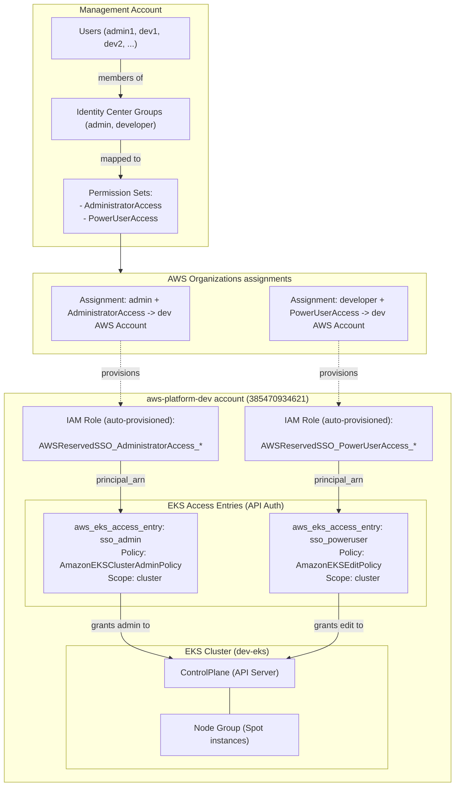
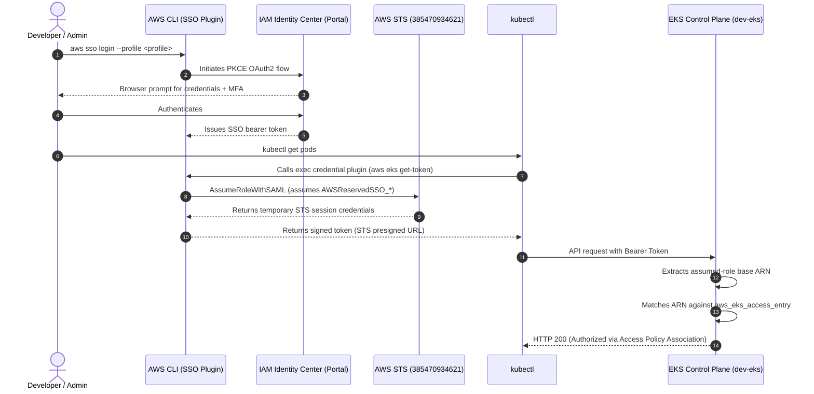

The purpose of this document is to describe how my personal AWS Organization and accounts are configured to allow different users and profiles to use IAM Identity Center to natively access and interact with an EKS cluster.

## Architecture

The setup separates centralized identity management from workload infrastructure across distinct AWS accounts within an AWS Organization.



---

Identity management is decoupled from individual AWS accounts:

1. **Identity Directory**:
   - Users (`admin1`, `dev1`, `dev2`) are defined centrally. Passwords and MFA enforcement reside only here.
   - Users are grouped into functional teams (e.g., `admin`, `developer`).

2. **Permission Sets**:
   - `AdministratorAccess`: Full administrative privileges across AWS services.
   - `PowerUserAccess`: Full AWS services access excluding direct IAM/Organization user and group management.

3. **Account Assignments**:
   - Groups are assigned to the target AWS account **`aws-platform-dev`** with their respective Permission Sets.
   - AWS Identity Center automatically provisions corresponding IAM Roles inside the AWS account with the path prefix `/aws-reserved/sso.amazonaws.com/` and the naming pattern:
     ```text
     AWSReservedSSO_<PermissionSetName>_<generated-hash>
     ```
   - Identity Center creates **one IAM Role per PermissionSet per target account**, not one role per user. Every member of the `developer` group assumes the same underlying `AWSReservedSSO_PowerUserAccess_*` IAM role in the Dev account.

---

When a user executes AWS CLI or `kubectl` commands, authentication traverses three stages: federated identity, STS role assumption, and EKS access validation.



Although users of the same permission set share the underlying IAM Role ARN, their specific username appears in the STS session name:
```text
arn:aws:sts::<DEV_ACCOUNT_ID>:assumed-role/AWSReservedSSO_PowerUserAccess_<hash>/<username>
```
AWS CloudTrail and EKS audit logs record `<username>` on every API call, preserving individual auditability.


