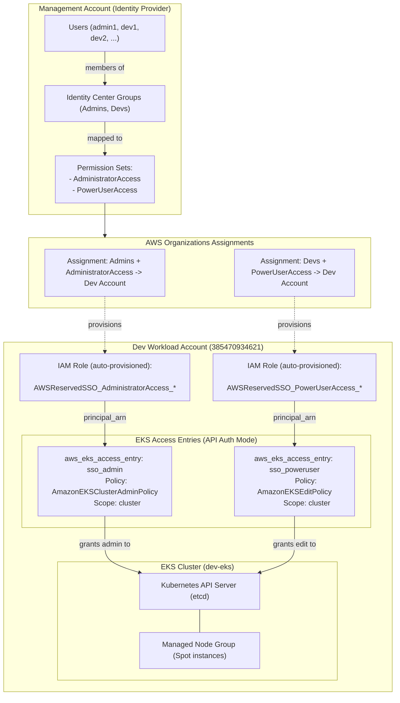
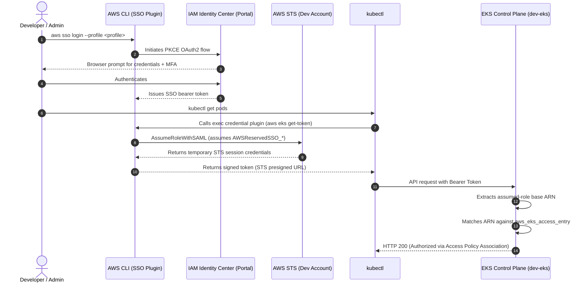

The purpose of this document is to describe how my personal AWS Organization and accounts are configured to allow different users and profiles to use IAM Identity Center to natively access and interact with an EKS cluster.

## Architecture

The setup separates centralized identity management from workload infrastructure across distinct AWS accounts within an AWS Organization.



---

## 1. AWS IAM Identity Center Configuration

Identity management is decoupled from individual AWS accounts:

1. **Identity Directory (Management Account)**:
   - Users (`admin1`, `dev1`, `dev2`) are defined centrally. Passwords and MFA enforcement reside only here.
   - Users are grouped into functional teams (e.g., `Admins`, `Developers`).

2. **Permission Sets**:
   - `AdministratorAccess`: Full administrative privileges across AWS services.
   - `PowerUserAccess`: Full AWS services access excluding direct IAM/Organization user and group management.

3. **Account Assignments**:
   - Groups are assigned to the target workload account (**Dev Account**) with their respective Permission Sets.
   - AWS Identity Center automatically provisions corresponding IAM execution roles inside the Dev Account with the path prefix `/aws-reserved/sso.amazonaws.com/` and the naming pattern:
     ```text
     AWSReservedSSO_<PermissionSetName>_<generated-hash>
     ```
   - **Crucial design aspect**: Identity Center creates **one IAM role per permission set per target account**, not one role per user. Every member of the Developers group assumes the same underlying `AWSReservedSSO_PowerUserAccess_*` IAM role in the Dev account.

---

## 2. Authentication & Authorization Flow

When a user executes AWS CLI or `kubectl` commands, authentication traverses three stages: federated identity, STS role assumption, and EKS access validation.



### Traceability
Although users of the same permission set share the underlying IAM Role ARN, their specific username appears in the STS session name:
```text
arn:aws:sts::<DEV_ACCOUNT_ID>:assumed-role/AWSReservedSSO_PowerUserAccess_<hash>/<username>
```
AWS CloudTrail and EKS audit logs record `<username>` on every API call, preserving individual auditability.

---

## 3. EKS Cluster Access Management (`authentication_mode = "API"`)

The cluster is configured in `eks.tf` to use native API authentication:

```hcl
access_config {
  authentication_mode                         = "API"
  bootstrap_cluster_creator_admin_permissions = false
}
```

This bypasses the legacy `aws-auth` ConfigMap entirely. Access is managed through two Terraform resources per role:

### 1. Dynamic IAM Role Discovery
Because the hash suffix in `AWSReservedSSO_<PermissionSet>_<hash>` is generated by AWS, data sources discover the exact ARN at runtime without hardcoding:

```hcl
data "aws_iam_roles" "sso_admin" {
  name_regex  = "^AWSReservedSSO_AdministratorAccess_.*"
  path_prefix = "/aws-reserved/sso.amazonaws.com/"
}

data "aws_iam_roles" "sso_poweruser" {
  name_regex  = "^AWSReservedSSO_PowerUserAccess_.*"
  path_prefix = "/aws-reserved/sso.amazonaws.com/"
}
```

### 2. Access Entries & Policy Associations
Defined in `eks_access_entries.tf`:

- **Administrators**:
  - Resource: `aws_eks_access_entry.sso_admin` registers the role ARN.
  - Association: `aws_eks_access_policy_association.sso_admin` links `arn:aws:eks::aws:cluster-access-policy/AmazonEKSClusterAdminPolicy` at `cluster` scope.

- **Developers**:
  - Resource: `aws_eks_access_entry.sso_poweruser` registers the role ARN.
  - Association: `aws_eks_access_policy_association.sso_poweruser` links `arn:aws:eks::aws:cluster-access-policy/AmazonEKSEditPolicy` at `cluster` scope (can also be restricted to specific namespaces).

---

## 4. Key Advantages of this Architecture

1. **Zero Static Credentials**: No IAM access keys or static secrets exist in member accounts.
2. **Horizontal User Scaling**: Adding a new user (`dev3`, `dev4`) only requires adding them to the Identity Center group in the Management Account. Dev account IAM roles and EKS access entries remain unchanged.
3. **Infrastructure as Code Parity**: With `bootstrap_cluster_creator_admin_permissions = false`, all cluster access rules are explicit, reviewed, and versioned in Terraform.
4. **Independent Identity Lifecycle**: Deactivating an employee in Identity Center revokes their access to AWS Console, CLI, and EKS across all accounts immediately.
